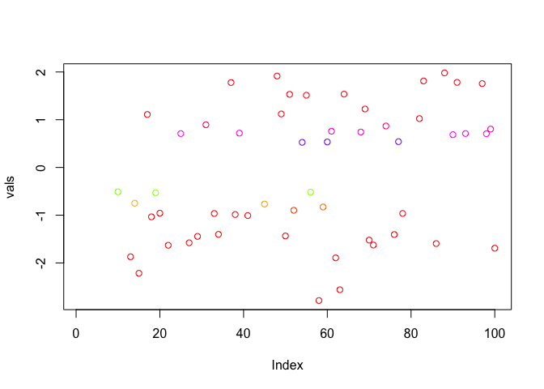

<!-- README.md is generated from README.Rmd. Please edit that file -->

# colorplane

<!-- badges: start -->

[](https://github.com/bbuchsbaum/colorplane/actions/workflows/R-CMD-check.yaml)

<!-- badges: end -->

The goal of `colorplane` is to facilitate the creation and manipulation
of color maps that can be rescaled, thresholded, and blended. The main
motivation for the package was to help with the creation of image
overlays for the display of scalar fields on a backgroound image
(e.g. for display of brain activation maps).

## Installation

You can install the development version of colorplane from
[GitHub](https://github.com/) with:

``` r
# install.packages("devtools")
devtools::install_github("bbuchsbaum/colorplane")
```

## Example

We create two color planes that map from “intensity” to colors provided
in a color map.

``` r
library(colorplane)

vals <- rnorm(100)
cmap <- IntensityColorPlane(vals, cols=rainbow(100))

## now we map to a set of colors, such that the color scale ranges from -1 to 1.
hexmap <- map_colors(cmap, irange=c(-1,1))
print(class(hexmap))
#> [1] "HexColorPlane"
#> attr(,"package")
#> [1] "colorplane"
plot(vals, col=hexmap@clr)
```


``` r

## let's do the same except threshold colors in the range [-.5,.5]
cmap2 <- map_colors(cmap, irange=c(-1,1), threshold=c(-.5,.5))

## cmap2 is an RGBColorPlane because we added element-wise transparency due to thresholding. 
## We can convert back to hexcolors to plot.
print(class(cmap2))
#> [1] "RGBColorPlane"
#> attr(,"package")
#> [1] "colorplane"

## Note value between [-.5,.5] are now invisible.
plot(vals, col=as_hexcol(cmap2))
```



We can also blend colors using alpha composition. Here we simply give
all colors a greenish tint to demonstrate color blending.

``` r

library(colorplane)

vals <- rnorm(100) 
bottom <- map_colors(IntensityColorPlane(vals, cols=rainbow(100)),irange=c(-1,1))
top <- ConstantColorPlane("#00FF00") 

blend <- blend_colors(bottom, top, alpha=.5)
plot(vals, col=as_hexcol(blend))
```


